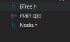
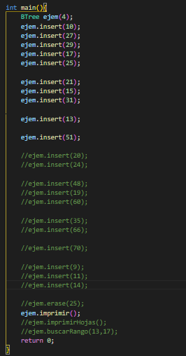
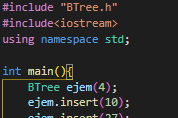
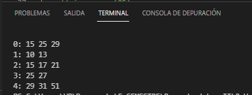

# Base-de-datos-II

Integrantes:
- ALBERT DANIEL LLICA ALVAREZ
- PIERO EMILIANO VIZCARRA VARGAS
- FABRIZIO MIGUEL MATTOS CAHUI
- ROY ANGEL CHOQUEHUANCA ANCONEYRA

# Manual
Cada archivo fue creado por separado para posteriormente unirlo, donde se pueden introducir las instrucciones en un .txt o por la terminal

## BTree
Al descargar la carpeta BTree puede probrarlo desde el main.cpp, desde ahí puede ejecutarlo.

  

Tiene algunos ejemplos para insertar, eliminar, buscar rango o imprimir todas la hojas, que estan comentados.

Al inicio puede indicar el número de frames que puede entrar en cada Nodo. 

Al ejecutar el programa, se podra observar por la terminal cada nodo enumerado con sus valores que contiene.

## Estrategias de reemplazo del buffer

## Scan - tokens
