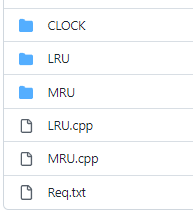
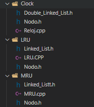
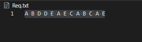
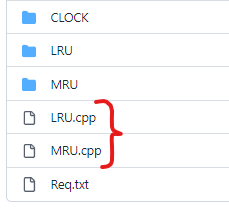
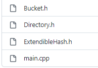
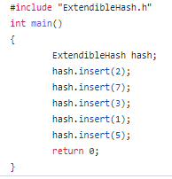

# Base-de-datos-II

Integrantes:
- ALBERT DANIEL LLICA ALVAREZ
- PIERO EMILIANO VIZCARRA VARGAS
- FABRIZIO MIGUEL MATTOS CAHUI
- ROY ANGEL CHOQUEHUANCA ANCONEYRA

# Manual
En este repositorio podra encontrar los diversos metodos aprendidos durante el curso de Base de Datos II de la Escuela de Ciencia de la Computacion de la UNSA.
Para poder operar este repositorio debe contar con:
* Sistema Operativo Compatible con C++
* Compilador de C++

## BTree
Al descargar la carpeta BTree puede probrarlo desde el main.cpp, desde ahí puede ejecutarlo.

  

Tiene algunos ejemplos para insertar, eliminar, buscar rango o imprimir todas la hojas, que estan comentados.

  

Al inicio puede indicar el número de frames que puede entrar en cada Nodo. 

  

Al ejecutar el programa, se podra observar por la terminal cada nodo enumerado con sus valores que contiene.

  

## Estrategias de reemplazo del buffer
Al ingresar a esta carpeta se puede observar tres carpetas, dos archivos .cpp y un .txt.

  

Dentro de estas tres carpetas se podra observar headers y un archivo .cpp en cada una, fueron hechas mediante clases.

  

Cada .cpp de estos archivos se puede ejecutar, no se introduce ningun parametro por la terminal o se escribe en el .cpp. Sino ocurre en el Req.txt

  

Los dos archivos .cpp al inicio cumple la misma función y leen el .txt, pero fueron hechos de otra forma, sin clases, mediante arrays.

  

## Hashing
Al ingresar se puede observar tres archivos.

  

Del cual el main.cpp es el principal para el funcionamiento

  

## Scan - tokens
Se puede encontrar un archivo, y al ejecutarlo se tiene que ingresar por terminal ciertas palabras para que funcione correctamente, como "add", "update" y "remove"

